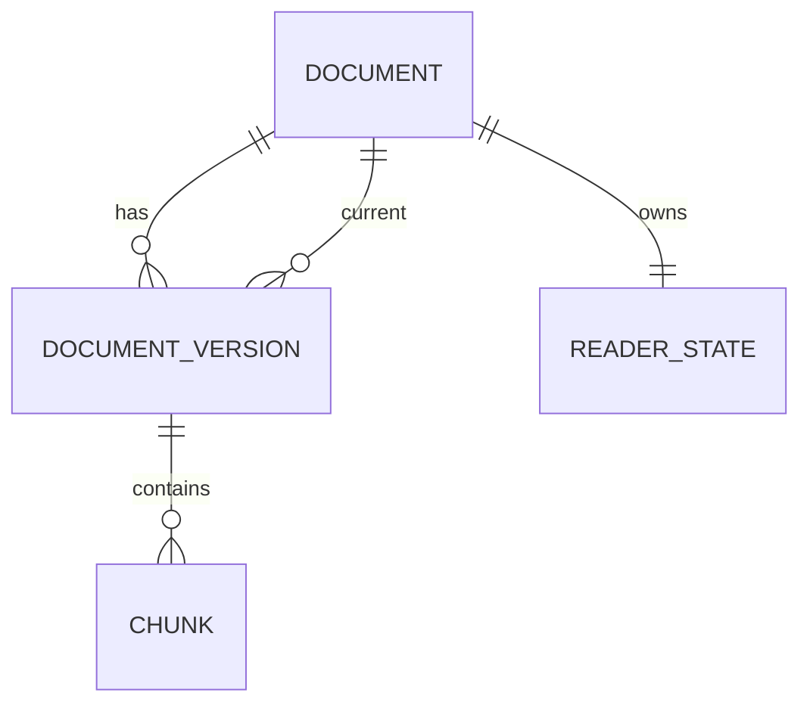

# Data and state

## Общие соглашения

- IDs: UUID strings из `crypto.randomUUID()`; не auto-increment.
- Время: integer UTC epoch milliseconds (`number`), UI форматирует через `Intl`.
- Ratios: finite `number` в `[0,1]`; byte/source offsets — non-negative safe integers.
- Enum values хранятся lowercase и валидируются при чтении.
- `DB_SCHEMA_VERSION`, `PIPELINE_VERSION`, `WORKER_PROTOCOL_VERSION` — отдельные constants.
- Persistent records проходят runtime schema validation. Invalid record не castится в domain type.

## Domain contracts

```ts
type DocumentId = string & { readonly __brand: 'DocumentId' };
type VersionId = string & { readonly __brand: 'VersionId' };
type ReadingMode = 'continuous' | 'sections';
type SplitStrategy = 'auto' | 'h1' | 'h2' | 'whole';
type ModeOrigin = 'auto' | 'user';
type RestoreConfidence = 'exact' | 'approximate' | 'none';

interface Document {
  id: DocumentId;
  title: string;
  normalizedTitle: string;
  fileName: string;
  normalizedFileName: string;
  currentVersionId: VersionId;
  createdAt: number;
  updatedAt: number;
  lastOpenedAt?: number;
}

interface DocumentVersion {
  id: VersionId;
  documentId: DocumentId;
  jobId: string;
  state: 'staging' | 'ready';
  contentHash: string;          // lowercase SHA-256 hex
  byteLength: number;
  charLength: number;
  encoding: 'utf-8';
  sourceBlob: Blob;
  title: string;
  outline: OutlineItem[];
  layouts: Record<SplitStrategy, SectionLayout>;
  chunkCount: number;
  pipelineVersion: number;
  importedAt: number;
  readyAt?: number;
}

interface OutlineItem {
  id: string;                  // app-prefixed deterministic heading id
  level: 1 | 2 | 3;
  text: string;
  pathKey: string;
  sourceStart: number;
  chunkOrdinal: number;
  childIds: string[];
}

interface SectionLayout {
  strategy: SplitStrategy;
  sectionIds: string[];
  sections: SectionRef[];
  safeForSelection: boolean;
  unavailableReason?: 'DOM_BUDGET' | 'OVERSIZED_NODE' | 'POC_LIMIT_UNKNOWN';
}

interface SectionRef {
  id: string;
  title?: string;
  startChunkOrdinal: number;
  endChunkOrdinalInclusive: number;
  headingId?: string;
  estimatedCost: number;
}
```

`whole` имеет один `SectionRef`, но его range читается bounded windows. `safeForSelection=false` запрещает user-visible selection до фиксации/прохождения budget.

```ts
type SanitizedHtml = string & { readonly __brand: 'SanitizedHtml' };

interface PersistedChunk {
  versionId: VersionId;
  ordinal: number;
  html: string;                // persisted unbranded bytes
  pipelineVersion: number;
  sourceStart: number;
  sourceEnd: number;
  estimatedCost: number;
  headingIds: string[];
  blockAnchors: BlockAnchor[];
  renderState: 'ready' | 'safe-fallback';
  diagnosticCode?: 'HIGHLIGHT_FAILED' | 'OVERSIZED_NODE' | 'FRAGMENT_FALLBACK';
}

interface BlockAnchor {
  blockId: string;             // stable within version
  headingPathKey: string;
  blockOrdinalWithinHeading: number;
  sourceStart: number;
  sourceEnd: number;
}

interface SemanticAnchor {
  versionId: VersionId;
  headingPathKey: string;
  blockOrdinalWithinHeading: number;
  blockId: string;
  intraBlockRatio: number;
  overallSourceRatio: number;
}

interface ReaderState {
  documentId: DocumentId;
  readingMode: ReadingMode;
  modeOrigin: ModeOrigin;
  splitStrategy: SplitStrategy;
  anchor?: SemanticAnchor;
  progressRatio: number;
  lastSectionId?: string;
  updatedAt: number;
}

interface AppPreferences {
  key: 'app';
  theme: 'system' | 'light' | 'dark';
  remoteImagesEnabled: boolean;
  desktopTocCollapsed: boolean;
  updatedAt: number;
}
```

Repository возвращает `SanitizedHtml` только после runtime validation record + equality `chunk.pipelineVersion === current PIPELINE_VERSION` + принадлежности current ready version. Единственная factory приватна infrastructure boundary.

## Связи



Document имеет ровно одну `currentVersionId`. Staging versions могут существовать, но не считаются current/visible. После replace старая ready version временно может существовать до cleanup.

## IndexedDB schema

Целевые Dexie stores; точный syntax фиксирует P01-T02 после spike:

| Store | Primary key | Required indexes | Назначение |
|---|---|---|---|
| `documents` | `id` | `normalizedTitle`, `normalizedFileName`, `lastOpenedAt`, `updatedAt` | Library metadata/similarity candidates |
| `documentVersions` | `id` | `documentId`, `state`, `contentHash`, `[documentId+state]`, `jobId`, `importedAt` | Raw source, published/staging versions |
| `chunks` | `[versionId+ordinal]` | `versionId`, `[versionId+sourceStart]` | Ordered bounded reader windows |
| `readerStates` | `documentId` | `updatedAt` | Per-document mode/strategy/progress |
| `preferences` | `key` | none | Global theme/privacy/TOC preference |

No index stores full title/content tokens for search in MVP. Exact duplicate query uses indexed `contentHash` and confirms version `ready`/current document validity.

## State ownership matrix

| State | Lifetime | Owner/source of truth | Change mechanism |
|---|---|---|---|
| Documents/current versions/chunks | Persistent | IndexedDB repository | Staged import/atomic commit/delete transaction |
| Reader mode/strategy/anchor/progress | Persistent | `readerStates` | Reader use cases; throttled controller + explicit mode switch |
| Theme/remote images/TOC collapse | Persistent | `preferences` | Platform preference use case; pre-paint theme mirror described below |
| Current route/document/hash | URL | React Router/browser history | Links/navigation/hash adapter |
| Import stage/progress/error | Ephemeral session | `ImportController` reducer | Worker/repository events |
| Open dialog/sheet/menu, focus owner | Ephemeral UI | Owning feature component/React Aria | User events/route changes |
| Virtual window measurements | Ephemeral imperative | Virtualizer adapter | Resize/scroll observers |
| Top visible semantic block | Ephemeral mutable controller, periodically persisted | `ReaderLocationController` | Observer/virtualizer callback |
| Online/update/storage health | Session/platform | Platform adapters | Browser/SW/storage events |
| Library scroll/focus return | Session | Route-level UI state/browser | Navigation/focus policy; not durable across browser restart |

Нельзя копировать current Document/ReaderState в глобальный React store. Narrow live queries возвращают metadata; transient optimistic state допускается только пока mutation pending и не изображает irreversible success.

## Theme bootstrap mirror

Чтобы не было flash incorrect theme, minimal `theme` string может зеркалироваться в `localStorage` только как pre-paint hint. IndexedDB `preferences` остаётся source of truth; после startup:

1. небольшой self-hosted bootstrap script, загруженный до app entry, применяет `system/light/dark` hint до React paint; допустимая альтернатива — build-generated fixed CSP hash для inline script, но не `unsafe-inline`;
2. preferences adapter читает IndexedDB;
3. при расхождении применяет IndexedDB и обновляет mirror;
4. изменение preference атомарно пишет IndexedDB, затем mirror.

Никакие document/progress data в `localStorage` не хранятся.

## Normalization и идентичность

- `fileName`: basename, Unicode preserved; path не доступен/не хранится.
- `normalizedFileName`: Unicode NFKC, trim, collapse whitespace, locale-independent lowercase, strip final `.md` for candidate matching.
- `title`: plain text первого H1 после inline Markdown normalization; иначе filename без extension; nonempty bounded display string.
- `normalizedTitle`: та же NFKC/whitespace/lowercase policy.
- Similarity: exact match normalized filename or title. Несколько candidates не выбираются автоматически; UI предлагает выбрать target или add separately.
- Exact identity: SHA-256 raw bytes, не decoded text. Hash duplicate допускается даже при другом filename.

## Heading, chunk и anchor IDs

- Heading slug строится из normalized visible text; ID format `mdr-h-{slug-or-heading}-{occurrence}`. Occurrence считается в document order.
- `pathKey` включает ancestry levels/text occurrence, например `1:introduction[1]/2:setup[2]`; не содержит raw HTML.
- Block ID стабилен внутри версии: hash/ordinal от normalized block type + source range; cross-version mapping не полагается только на него.
- Chunk ordinal contiguous `0..chunkCount-1`; commit отвергает gaps/duplicates/overlap/out-of-order source ranges.
- Layout ranges обязаны быть valid, ordered, non-overlapping and cover chunks according to strategy; property tests доказывают coverage.

## Import, serialization и validation

1. Validate one `.md` (case-insensitive extension); MIME — hint, не authority.
2. Enforce measured byte limit before full read.
3. Fatal UTF-8 `TextDecoder`; invalid input fails without partial document.
4. Hash raw bytes; parse decoded text once.
5. Build metadata/outline/chunks/layouts with numeric limits.
6. Persist batches as structured clone records. HTML is a string but trusted only by provenance/version validation.
7. Commit verifies hash, counts, version/job ownership, ranges and expected current version precondition.

Persisted content never includes live DOM nodes, React elements, complete AST or generated object URLs.

## Atomicity and lifecycle

### New document

- Allocate provisional `documentId`, `versionId`, `jobId`.
- Stage DocumentVersion + batches; Document record absent.
- Commit transaction validates all records, creates Document and default ReaderState, flips version ready/current.

### Replace

- Capture `expectedCurrentVersionId` and old ReaderState.
- Stage new version under same `documentId`.
- Map anchor before/within commit result.
- Commit only if Document still points to expected current version; otherwise `COMMIT_CONFLICT`.
- Old version/chunks cleanup occurs after successful switch; cleanup is idempotent.

### Cancel/failure/startup cleanup

- `abortVersion(jobId)` deletes only that staging version/chunks.
- Startup removes staging older than measured/defined abandonment duration only when no active same-tab job marker; no ready version is touched.
- Cleanup may be retried. UI visibility derives only from Documents + current ready version.

### Delete

One transaction deletes ReaderState, all chunks for all document versions, versions, then Document. UI removes item only after success. Preferences remain.

## Versioning and migrations

- Dexie migrations are forward-only, idempotent at record transformation level and separately integration-tested with fixtures from every prior schema shipped.
- Migration never deletes `sourceBlob` merely because derived fields are invalid. On unsafe migration failure, app opens recovery state and preserves records.
- Pipeline mismatch sets derived status stale; rebuild stages from Blob and atomic-switches. Reader may use old ready derived data only if its sanitizer policy is still allowed; a security-invalid pipeline forces blocking reprocess.
- Worker protocol mismatch aborts job; main/worker bundles from different SW versions trigger update/reload guidance, not best-effort parsing.

## Progress persistence and mapping

- Observer selects top visible meaningful block relative to sticky toolbar.
- `intraBlockRatio` estimates progress within that block; `overallSourceRatio` is fallback and library percentage source.
- Writes are trailing-throttled; exact interval is performance implementation detail measured in P03-T04. Explicit TOC/mode/route actions flush immediately.
- Mapping order on mode/strategy: same block → same heading path + ordinal → nearest heading → source ratio → start.
- Mapping across version: normalized path with occurrence → nearest matching ancestor/block ordinal → source ratio. Result returns confidence and reason.
- `none` opens start and visible notice; `approximate` shows dismissible notice. Confidence never inferred silently in UI.

## Quota, corruption, limits

- Before import, `StorageManager.estimate()` can warn but cannot guarantee commit. `QuotaExceededError` aborts staging and leaves ready data.
- `persist()` is requested only after user context/success explanation; denial is warning, not block.
- Record validation failure localizes to version/chunk when possible. Corrupted current derived data prompts rebuild from source; corrupted/missing source prompts reimport, never automatic clear-all.
- File/node/chunk/decoded data limits come from F00 spikes and live in one `PipelineLimits` config with test fixtures at/below/above each limit.
- Browser eviction cannot be recovered in MVP; copy explicitly tells user to retain original `.md`.

## Import/export/clear

- Import supports only one source `.md` and replacement/separate decisions.
- Library export/restore is deferred; no hidden unstable format is exposed.
- Delete one document is supported. «Clear all data» is not an MVP UI action; diagnostics may explain browser site-data controls but never invoke them as first recovery.
