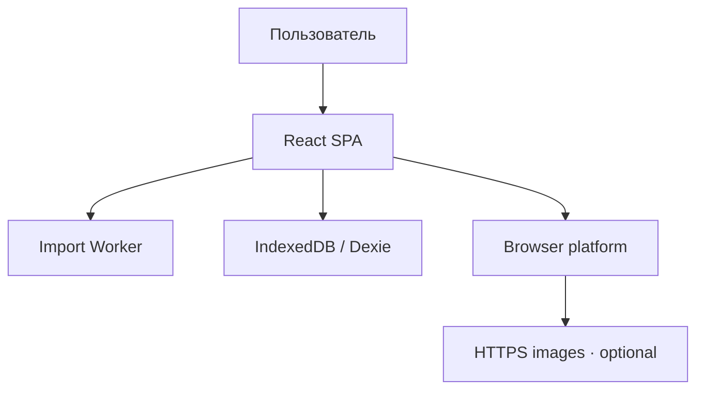
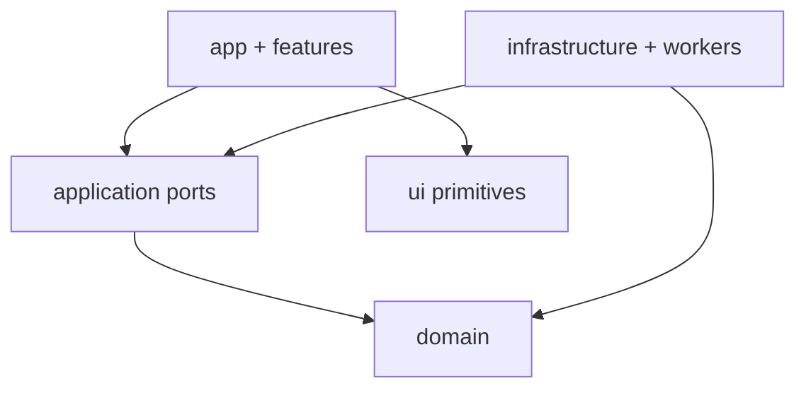
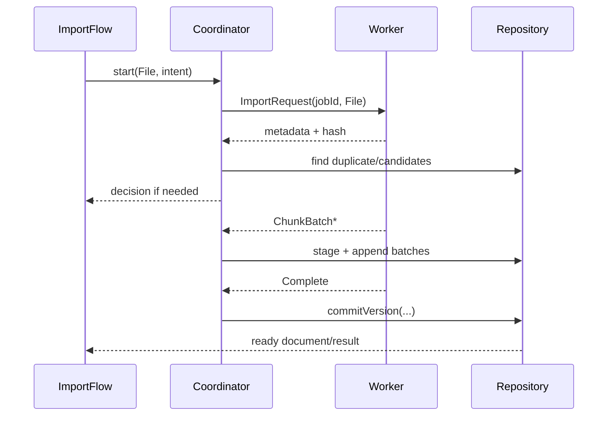

# System architecture

## Architectural style

Client-only modular SPA with ports/adapters and a local-first persistence model. React owns composition and interaction; pure TypeScript domain owns parsing policies, partitioning, duplicate/update decisions and position mapping; infrastructure owns browser APIs. Heavy untrusted-content work runs in a dedicated worker.

Это не formal Clean Architecture ceremony: границы существуют только там, где отделяют React, storage, worker и недоверенный content pipeline.

## Runtime context



- Static host раздаёт hashed assets, SPA fallback и security headers по стабильному HTTPS origin.
- Service worker precache содержит только app shell/build assets. Document bytes и derived content находятся в IndexedDB.
- Сеть не нужна для import/read. Исключение — разрешённая загрузка HTTPS remote image; она не кэшируется как document asset.
- File picker/DropZone передают browser `File`; никаких upload requests нет.

## Модули и ответственность

| Слой/модуль | Ответственность | Не имеет права |
|---|---|---|
| `app` | Composition root, providers, router, route boundaries, global statuses | Парсить Markdown, запрашивать chunks напрямую из Dexie tables |
| `features/library` | Library query/use cases, import/delete entry points, list UI | Владеть DB schema, вычислять duplicate policy |
| `features/import` | Import UI reducer/controller, worker/repository orchestration adapter | Санитизировать HTML в UI, публиковать staging records напрямую |
| `features/reader` | Reader shell, TOC/settings, virtualizer adapter, location controller | Хранить whole document/chunk corpus, менять pipeline rules |
| `domain/documents` | Entities, normalized identity, layouts, duplicate/update policy | Импортировать React/DOM/Dexie |
| `domain/content` | AST block model, partition invariants, heading IDs, URL/content policy contracts | Использовать browser DOM as sanitizer |
| `domain/reading` | Semantic anchor, mapping confidence, progress calculation | Хранить pixel offset как canonical location |
| `application` | Use-case ports: import, replace, delete, open, reprocess | Зависеть от конкретных UI primitives |
| `infrastructure/db` | Dexie schema, repositories, migrations, atomic commit/cleanup | Возвращать unvalidated stale HTML as safe |
| `infrastructure/platform` | storage health, online status, theme bootstrap, URL/hash, PWA update | Содержать product business rules |
| `workers` | Decode, hash, parse, partition, sanitize, highlight, batching | Мутировать UI/React; использовать unversioned messages |
| `ui/primitives` | Installed/adapted shadcn React Aria components | Содержать feature state machines |

## Допустимые зависимости



`domain` — нижний независимый слой. Infrastructure реализует ports и внедряется composition root. Feature может использовать domain types, но side effects проходят application/repository ports. Линтер/import-boundary tests должны запретить обратные зависимости.

## Routes и entry points

| Route | Entry | Exit/behavior |
|---|---|---|
| `/` | Startup, logo, Back from reader | Library; import/delete/replace overlays не создают самостоятельный route |
| `/documents/:documentId` | Open/continue/success/duplicate | Restore saved anchor; missing local document → recovery state |
| `/documents/:documentId#heading-id` | Explicit TOC/deep link | Hash overrides saved anchor once; invalid heading → nearest ancestor/start notice |
| `*` | Unknown URL | Route error state + link to `/` |

Mode/strategy — per-document preferences в IndexedDB, не query params. Passive scroll не пишет browser history.

## Import data flow



1. UI pre-validates one `.md`; worker performs authoritative byte length and fatal UTF-8 decode.
2. Worker computes SHA-256 and metadata. Coordinator checks exact ready-version hash before finalizing.
3. If user decision is needed, worker result/job remains controlled staging; cancel removes it.
4. Worker sends bounded batches with monotonic `batchOrdinal`; repository rejects wrong job/protocol/order.
5. Commit transaction creates/updates Document, marks version ready, sets `currentVersionId`, maps reader state and publishes library visibility.
6. Previous ready version is deleted only in post-commit cleanup. A failed cleanup is recoverable garbage, not data loss.

Cancellation: controller sends `Cancel(jobId)`, ignores later nonterminal messages for that job, terminates worker after bounded handshake timeout, calls `abortVersion`, and returns UI to `cancelled`. Browser/tab termination leaves staging for startup cleanup.

## Reader data flow and state ownership

1. Route supplies `documentId` and optional hash.
2. Reader use case loads Document + current ready version metadata + ReaderState.
3. Location resolver chooses explicit heading, saved anchor or document start.
4. Repository returns layout metadata and only chunk range required by current section/virtual window.
5. `SafeHtmlChunk` renders repository-branded values. It does not sanitize or transform.
6. Intersection/virtualizer callback updates an imperative `ReaderLocationController`; derived progress is throttled into ReaderState, not React state per scroll event.
7. `pagehide`, route leave and deliberate mode change trigger final best-effort persistence without unload prompt.

## Worker protocol

Every message contains `protocolVersion` and `jobId`.

```ts
type MainToWorker =
  | { type: 'import.request'; protocolVersion: number; jobId: string; file: File; limits: PipelineLimits }
  | { type: 'import.continue'; protocolVersion: number; jobId: string; decision: ImportDecision }
  | { type: 'import.cancel'; protocolVersion: number; jobId: string };

type WorkerToMain =
  | { type: 'import.progress'; protocolVersion: number; jobId: string; stage: ImportStage; ratio?: number }
  | { type: 'import.metadata'; protocolVersion: number; jobId: string; metadata: ParsedMetadata }
  | { type: 'import.chunkBatch'; protocolVersion: number; jobId: string; batchOrdinal: number; chunks: PersistableChunk[] }
  | { type: 'import.complete'; protocolVersion: number; jobId: string; result: PipelineResult }
  | { type: 'import.failure'; protocolVersion: number; jobId: string; error: ImportError }
  | { type: 'import.cancelled'; protocolVersion: number; jobId: string };
```

Actual contracts live in a shared protocol module that imports no worker/DOM globals. Unknown version/message fails closed with `PROTOCOL_MISMATCH`.

## Async processes and concurrency

- Одновременно один active import per tab in MVP; additional attempt focuses current flow. This avoids unmeasured memory amplification.
- IndexedDB transactions serialize publication. `currentVersionId` is changed only when all expected batches exist and metadata counts/ranges validate.
- Multiple tabs may observe Dexie writes, but MVP не обещает collaborative coordination. Commit uses current-version precondition; stale replacement aborts with recoverable conflict.
- Pipeline rebuild after `PIPELINE_VERSION` mismatch creates a new staging derived version from same source Blob and uses the same atomic switch.
- Service-worker update may be prepared anytime, but reload/apply is disabled while import/finalization is active.

## Error model and recovery

| Boundary | Stable errors | Recovery |
|---|---|---|
| File | `MULTIPLE_FILES`, `UNSUPPORTED_EXTENSION`, `FILE_TOO_LARGE`, `INVALID_UTF8` | Select another/resave UTF-8 |
| Worker | `PROTOCOL_MISMATCH`, `PIPELINE_LIMIT`, `WORKER_CRASH`, `CANCELLED` | Abort staging; retry after diagnostics |
| Content | `UNSUPPORTED_LANGUAGE`, `HIGHLIGHT_FAILED`, `OVERSIZED_NODE` | Escaped safe fallback for node; import continues when integrity is known |
| Storage | `DB_UNAVAILABLE`, `QUOTA_EXCEEDED`, `MIGRATION_FAILED`, `COMMIT_CONFLICT` | Keep ready data; retry/free space/reimport; never auto-clear |
| Reader | `DOCUMENT_NOT_FOUND`, `STALE_DERIVED`, `CHUNK_READ_FAILED`, `ANCHOR_NOT_FOUND` | Library/reprocess/partial placeholder/approximate fallback |
| Platform | `OFFLINE_RESOURCE`, `UPDATE_FAILED`, `PERSISTENCE_DENIED` | Local read continues; retry/later/explanation |

Route error boundary catches unexpected React failures only. Expected domain errors use typed Result and screen states.

## Trust boundaries and security

- Untrusted: filename, bytes, decoded Markdown, AST raw HTML, heading text, language labels, URLs and existing IndexedDB content.
- Raw HTML nodes are converted to escaped literal text. `allowDangerousHtml` is false; `rehype-raw` is not used in MVP.
- URL policy runs before serialization; sanitizer allowlist runs after HAST transformations/highlight and before stringify. Sanitized output is rebranded only by repository when `pipelineVersion` matches.
- Heading/footnote IDs are application-generated with a fixed prefix, slug + occurrence; user-provided `id/name` is discarded to prevent clobbering.
- Links: allow `#`, `http`, `https`, `mailto`; external HTTP(S) gets `_blank`, `rel="noopener noreferrer"`. Block `javascript`, `data`, `file`, `blob` and unknown protocols.
- Images: allow `https` when preference on and safe raster `data:image/{png,jpeg,gif,webp,avif}` under measured decoded limit; block SVG data, HTTP, file/blob and relative paths. Use `referrerpolicy="no-referrer"`, lazy/async decode.
- CSP target: `default-src 'self'; script-src 'self'; worker-src 'self'; style-src 'self'; img-src 'self' data: https:; object-src 'none'; base-uri 'none'; frame-ancestors 'none'; connect-src 'self'`. Deployment must decide whether Tailwind/generated styles require a nonce/hash change; `unsafe-eval` запрещён.
- Diagnostics include error codes/counts/sizes, never document text or full URLs containing secrets.

## Proposed source tree

```text
src/
  app/                    # composition, router, providers, error boundaries
  application/            # use cases and ports
  domain/
    documents/
    content/
    reading/
  features/
    library/
    import/
    reader/
    platform-status/
  infrastructure/
    db/
    platform/
    pwa/
  workers/
  ui/
    primitives/
    theme/
  styles/
    reader-content.css
  test/
    fixtures/
    corpus/
e2e/
```

Не создавать placeholder folders до задачи, которая вводит их ответственность.

## Запрещённые сокращения

- Parse/sanitize/highlight в React render/main thread.
- Один giant HTML string, persisted full AST или `chunks[]` всего документа в Context.
- Direct Dexie imports из screen components.
- `dangerouslySetInnerHTML` вне `SafeHtmlChunk` или brand через обычный cast.
- Публикация Document до complete batch validation.
- Pixel scrollTop как source of truth.
- Strategy `whole`, которая монтирует весь документ.
- Второй sanitizer «на всякий случай», permissive raw HTML или dynamic execution.
- Silent data deletion при migration/quota/corruption.
- Auto reload service worker во время active task.

## Проверенные нестабильные детали

- [React Router 8](https://reactrouter.com/) имеет modern baseline Node 22+, React 19+; bootstrap проверяет текущие точные minimum patches.
- [React Router modes](https://reactrouter.com/start/modes) подтверждают Declarative Mode как наименее навязывающий architecture вариант.
- [shadcn React Aria base](https://ui.shadcn.com/docs/changelog/2026-07-react-aria) и `--base aria` доступны, но component/focus PoC обязателен.
- [TanStack React Virtual](https://tanstack.com/virtual/latest/docs/framework/react/react-virtual) документирует `useFlushSync` и `directDomUpdates`; оба являются measured options, не defaults спецификации.
- [Vite PWA React integration](https://vite-pwa-org.netlify.app/frameworks/react) поддерживает prompt update; callback state должен использовать stable references.
