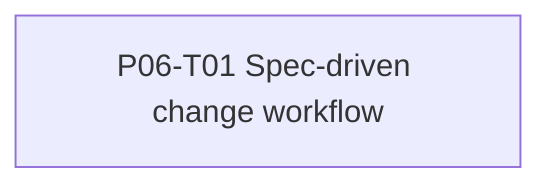

# CHG-001 Task plan: Spec-driven change workflow

## Phase assignment

- Roadmap phase: P06 — Post-MVP evolution governance.
- Phase outcome: future requests have a governed path into the existing task execution system.
- Phase gate: workflow, registry, templates and canonical-document reconciliation pass documentation verification.

## Dependency graph

## Tasks

| Task | Outcome | Requirements / scenarios | Dependencies | Parallel group | Shared-contract owner | Status |
|---|---|---|---|---|---|---|
| P06-T01 | Repository-native change lifecycle and templates | CHG-001-FR-001 through FR-011; US-001 through US-005 | P05-T05 | None | All governance documents in scope | `completed` |

## Coverage check

| Requirement / criterion | Task or manual evidence |
|---|---|
| CHG-001-FR-001 through FR-011 | P06-T01 acceptance criteria and documentation review |
| CHG-001-SC-001 through SC-004 | Workflow, templates, registry and cross-artifact analysis |
| CHG-001-SC-005 | Final changed-file inspection |

## Parallel-work rules

No task is parallelized. This change has one task and one owner for the overlapping governance documents.

## Ready gate

- [x] The authoritative P06-T01 file exists in `codex-spec/tasks/`.
- [x] P06-T01 has explicit prerequisites, scope, non-goals, tests and verification.
- [x] Every requirement and acceptance scenario maps to P06-T01 or final manual evidence.
- [x] The task does not invent product behavior absent from `spec.md`.
- [x] Roadmap and implementation status are updated.
- [x] `analysis.md` has no blocking finding.
