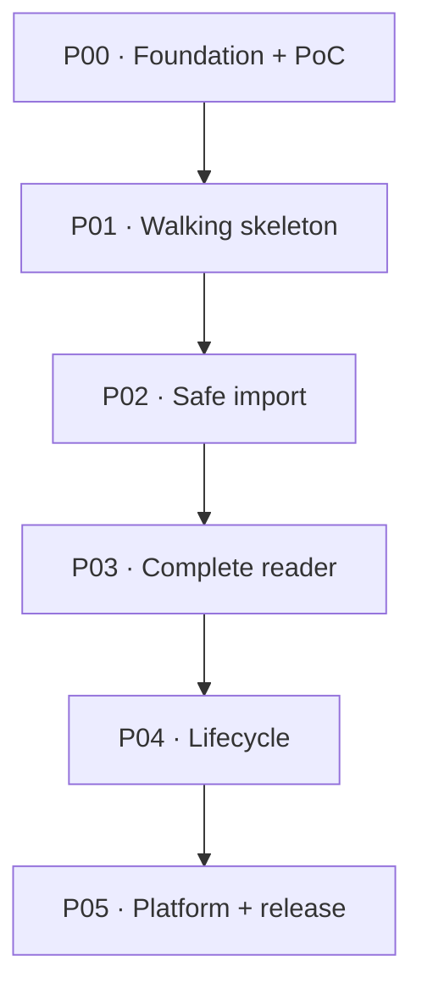

# Implementation roadmap

## Dependency graph

Task files are authoritative for scope/verification. This roadmap is authoritative for order/gates.

## P00 — Foundation and mandatory risk reduction

**Outcome:** reproducible toolchain plus evidence-backed pipeline/storage/virtualization/mapping/mobile decisions. App may be a diagnostic shell, not MVP.

| Task | Result | Dependencies / parallelism |
|---|---|---|
| P00-T01 | Project bootstrap, scripts, boundaries, base CI-ready commands | First |
| P00-T02 | Pipeline/security/corpus spike and limits proposal | After T01; parallel T03/T04/T06 |
| P00-T03 | IndexedDB atomicity/migration spike | After T01; parallel |
| P00-T04 | Continuous virtual-reader spike | After T01; parallel |
| P00-T05 | Semantic mapping spike and confidence policy | After T02 |
| P00-T06 | shadcn/React Aria + mobile Safari/PWA primitive spike | After T01; parallel |

**Gate:** all reports/fixtures committed; spikes 1/3/5 pass or fallback/roadmap explicitly changed; `pnpm typecheck/lint/test/build` green. Status may move from `Requires PoC` only after this gate.

**Risks closed:** invented thresholds, unsafe pipeline, non-atomic model, unusable Safari virtualization/focus.

## P01 — Minimal end-to-end walking skeleton

**Outcome:** user can run app, import a minimal safe fixture into real IndexedDB, see it in Library, open a bounded basic Reader and survive reload. UI is intentionally incomplete but real path crosses all architectural boundaries.

| Task | Result | Dependencies / parallelism |
|---|---|---|
| P01-T01 | App shell/routes/error boundary/string/theme foundations | P00-T01/T06; parallel T02 |
| P01-T02 | Production schema/repository/migrations/cleanup skeleton | P00-T03; parallel T01 |
| P01-T03 | Minimal worker→stage→commit→library vertical slice | T01/T02, P00-T02 |
| P01-T04 | Minimal current-version reader and reload restore | T03, P00-T04 |

**Gate:** one fixture imports/reads/reloads; failure before commit leaves no Document; real commands green. No fake in-memory repository in final walking path.

## P02 — Production-safe import

**Outcome:** supported Markdown corpus imports through secure versioned pipeline; responsive ImportFlow handles progress/cancel/errors and duplicate/update decisions.

| Task | Result | Dependencies / parallelism |
|---|---|---|
| P02-T01 | Production pipeline, policy, layouts, batching and security tests | P01-T03, P00-T02; parallel T02 |
| P02-T02 | Complete O-01/L-01 import UI state machine and focus/error states | P01-T03, P00-T06; parallel T01 |
| P02-T03 | Exact duplicate and possible-update decision flow | T01/T02 |

**Gate:** corpus no-loss/security; cancel/quota/worker failure; exact duplicate/update choices; 320 px/keyboard; import E2E green.

## P03 — Complete reading experience

**Outcome:** whole document is navigable in continuous/sections, TOC/deep links work, mode/strategy and semantic progress restore reliably.

| Task | Result | Dependencies / parallelism |
|---|---|---|
| P03-T01 | Whole-document TOC, heading IDs/hash and reader state shells | P01-T04, P02-T01 |
| P03-T02 | Production continuous bounded reader | P03-T01, P00-T04; parallel T03 |
| P03-T03 | Sections pager, strategies, auto mode, media/overflow states | P03-T01, P00-T05; parallel T02 |
| P03-T04 | Location controller, persistence and cross-mode restore | T02/T03, P00-T05 |

**Gate:** all markers reachable in both modes; TOC far jump; reload/mode/strategy mapping within measured tolerance/fallback; DOM/performance/a11y target browsers green.

## P04 — Document lifecycle and reader hardening

**Outcome:** library management, replace mapping and complete Reader error/accessibility states are trustworthy.

| Task | Result | Dependencies / parallelism |
|---|---|---|
| P04-T01 | Library management + confirmed transactional delete | P02-T02, P01-T02; parallel T02 when dependencies allow |
| P04-T02 | Atomic replace/separate + cross-version mapping/cleanup | P02-T03, P03-T04 |
| P04-T03 | Missing/stale/partial/error states and end-to-end focus/a11y hardening | T01/T02, P03-T04 |

**Gate:** duplicate/replace/delete failure safety E2E; mapping notices; no focus loss; route/partial recovery passed.

## P05 — Themes, PWA, storage and release

**Outcome:** production build works offline after first visit, update/storage/privacy UX is complete, themes/responsive/accessibility/security/browser gates pass.

| Task | Result | Dependencies / parallelism |
|---|---|---|
| P05-T01 | Final light/dark/editorial responsive UI + no-flash theme | P01-T01, P03-T04, P00-T06; parallel T02 |
| P05-T02 | PWA app shell/offline/update controller | P01-T01/T02, P00-T06; parallel T01 |
| P05-T03 | Storage health/recovery + remote resource preference/status priority | P05-T02, P02-T02, P01-T02 |
| P05-T04 | Security/accessibility/browser/performance hardening | P05-T01/T02/T03, P02-T01, P04-T02/P04-T03 |
| P05-T05 | Final acceptance, docs/status and release evidence | T04 and every earlier phase gate |

**Gate:** `codex-spec/final-acceptance-checklist.md` complete; all commands/browser/device/manual gates green; no blocking defects.

## Parallelism rules

- Parallel tasks may not edit the same contracts/config without explicit coordination. P00 spikes write separate reports and central decisions are merged after results.
- P01 shell/repository can run in parallel because ports are specified; integration task starts only after both land.
- P02 pipeline/UI can run against shared protocol contract; one owner changes protocol at a time.
- P03 continuous/sections can run in parallel after TOC/state contracts, but P03-T04 integrates only after both.
- P05 theme and PWA can run in parallel; storage/global status integration waits for both relevant shell/platform boundaries.
- A downstream task must inspect completed code, not assume task status from filename.

## Functional checkpoints

| Gate | What can actually be run/seen |
|---|---|
| P00 | Reproducible diagnostic corpus and selected safe implementation paths |
| P01 | Real local import → library → reader → reload skeleton |
| P02 | Safe complete import UX with corpus, cancel/errors/duplicate decisions |
| P03 | Full core reading in both modes with TOC and persistent position |
| P04 | Complete document lifecycle and recovery/accessibility behavior |
| P05 | Offline-capable, themed, hardened release candidate |
