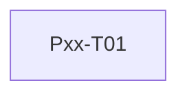

# CHG-NNN Task plan: <title>

## Phase assignment

- Roadmap phase:
- Phase outcome:
- Phase gate:

## Dependency graph

## Tasks

| Task | Outcome | Requirements / scenarios | Dependencies | Parallel group | Shared-contract owner | Status |
|---|---|---|---|---|---|---|
| Pxx-T01 | | | None | None | | `not-started` |

## Coverage check

| Requirement / criterion | Task or manual evidence |
|---|---|
| | |

## Parallel-work rules

- Tasks in the same parallel group must not edit the same contract, schema, central configuration or migration.
- Every shared contract has exactly one owner task.
- Integration waits for all declared dependencies and receives their current code, not only their reports.

## Ready gate

- [ ] Every task has an authoritative file in `codex-spec/tasks/`.
- [ ] Every task has explicit prerequisites, scope, non-goals, tests and verification.
- [ ] Every requirement and acceptance scenario has coverage.
- [ ] No task invents behavior absent from `spec.md`.
- [ ] Roadmap and post-MVP task status are updated.
- [ ] `analysis.md` has no blocking finding.
